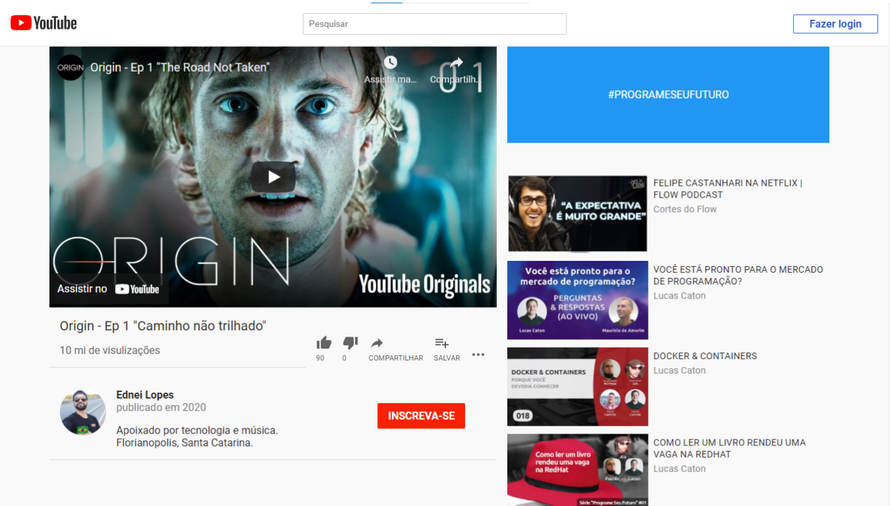

<h1 align="center"> Youtube clone </h1> 
Projeto youtube clone desenvolvido no curso desenvolvimento web do Clucas Caton. Aplicando conhecimentos de css grid e flex box.

<a href="https://edy-ux.github.io/youtube_clone/"> Veja o Projeto Aqui</a>

<h2>Tecnologias</h2>
 <ul>
      <li>HTML5</li>
      <li>CSS3</li>
</ul>
